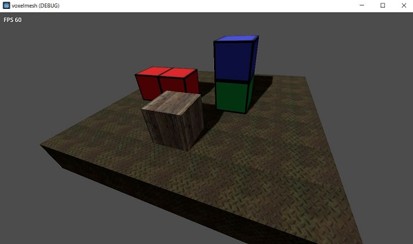

# Voxels-with-one-texture-in-Godot
programmed with C# for Godot 4. only for fun. all voxels have one texture. all voxels with the same texture are created in one mesh. if there are voxels beside - the faces are not drawn.   
not recommended for things like games, cause theres for example no chunks.  

first screenshot:    

     
  
# Last changes:    
- enum for texturenames
  
